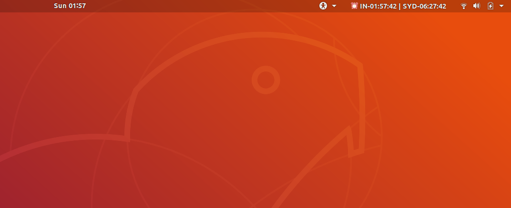

# X-Clock

A tiny executable binary used to display time information in system-tray.

## Build and Install

This will install application in `/usr/bin` and also it make desktop entry.

- Clone or download the project `git clone github.com/prakashpandey/x-clock`
- `cd x-clock`
- `chmod +x ./bin/install.sh`
- `./bin/install.sh`

## Screenshot

## Based on

[getlantern/systray](https://github.com/getlantern/systray)

## License

Entire application is released with [MIT License](LICENSE) other than the third party icon images in `assets` folder.

## Icon credits

      Icons made by <a href="https://www.flaticon.com/authors/smashicons" title="Smashicons">Smashicons</a> from <a href="https://www.flaticon.com/" title="Flaticon">www.flaticon.com</a> is licensed by <a href="http://creativecommons.org/licenses/by/3.0/" title="Creative Commons BY 3.0" target="_blank">CC 3.0 BY</a>

